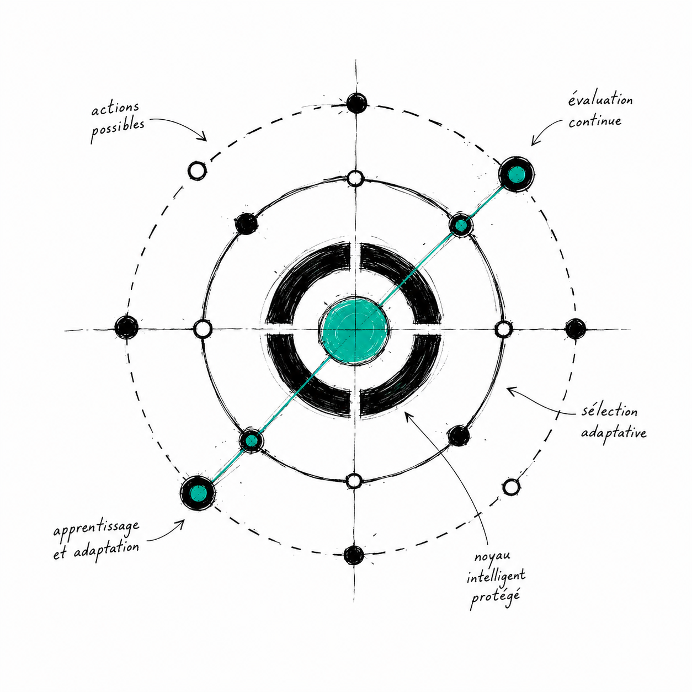

<div align="center">



# ACIES

**Adaptive Perception Control**

A decision-theoretic framework for adaptively controlling visual perception to minimize computational cost while maintaining target decision risk.

[](LICENSE)
[](https://www.python.org/downloads/)
[](https://go.dev/)
[](#testing)
[](#benchmarks)

*Perception is not a fixed pipeline. It is a resource to control.*

</div>

---

## What is ACIES?

ACIES treats visual perception as a **resource allocation problem**. Instead of processing every input at maximum resolution, it adaptively selects *what* to perceive by solving a cost-risk optimization at each step.

**Core idea:** heterogeneous perception actions (resize to 64p, crop a region, activate layers) have different costs and different information gains. ACIES picks the action that maximizes **ΔR/C** — risk reduction per unit cost.

### Key Results (MNIST, 10,000 images)

| Method | Accuracy | Cost | Savings |
|--------|:--------:|:----:|:-------:|
| Fixed 1024p | 98.8% | 385.8 | — |
| **ACIES** | **90.8%** | **93.6** | **76%** |
| Fixed 224p | 82.1% | 76.5 | 80% |
| Random | 95.5% | 149.6 | 61% |

## Quick Start

### Python

```python
from acies import APCController, APCConfig, HardwareProfile

apc = APCController(APCConfig(
    confidence_threshold=0.92,
    hardware=HardwareProfile.jetson_orin(),
))

def clarity_fn(action):
    clarities = {
        "64p": 0.55, "128p": 0.65, "224p": 0.75,
        "320p": 0.82, "512p": 0.88, "1024p": 0.93,
        "crop_224": 0.85, "crop_320": 0.90, "crop_512": 0.92,
    }
    return clarities.get(action.name, 0.5)

result = apc.run(true_class=1, clarity_fn=clarity_fn)
print(f"Decision: {result.decision} | Cost: {result.total_cost:.1f} | Steps: {result.n_steps}")
```

### Go CLI

```bash
go build -o acies-cli .

./acies-cli run --hardware jetson --verbose
./acies-cli bench --iterations 5000 --hardware rpi
./acies-cli config
```

### Docker

```bash
docker build -t acies .
docker run acies bench --iterations 1000
```

## Installation

```bash
git clone https://github.com/NICE-DEV226/ACIES.git
cd ACIES
```

**Python only** — no external dependencies, just stdlib.

**With C++ acceleration:**
```bash
cd cpp && make && cd ..
```

**With Go CLI:**
```bash
go build -o acies-cli .
```

**Verify:**
```bash
python3 test_apc.py          # 8/8 tests
./acies-cli version          # ACIES v0.1.0
```

## Architecture

```
Input
  │
  ▼
┌──────────────────────────────────────────────────┐
│                  APCController                    │
│                                                   │
│  BeliefState ─── ClarityLearner ─── SafetyLayer  │
│  (Bayesian)      (Thompson)         (risk guard) │
│       │                │                │         │
│  Conviction ──── ChangePoint ──────────┘         │
│  (anti-oscill)   (shift detect)                   │
│                                                   │
│  Action Space: 64p │ 128p │ ... │ 1024p │ crops  │
│  HardwareProfile: Jetson │ RPi │ GPU │ TPU       │
└──────────────────────────────────────────────────┘
  │
  ▼
Decision (class + confidence)
```

**Control loop:** Sample → Score (ΔR/C) → Adjust (conviction) → Filter (safety) → Execute → Observe → Update → Check (change-point) → Repeat

## Project Structure

```
ACIES/
├── acies/                     # Python package
│   ├── __init__.py            # Exports
│   ├── actions.py             # Action space & hardware profiles
│   ├── belief.py              # Bayesian belief tracker
│   ├── clarity_learner.py     # Thompson Sampling
│   ├── safety.py              # Safety layer (risk guarantees)
│   ├── conviction.py          # Anti-oscillation mechanism
│   ├── change_point.py        # Bayesian change-point detection
│   ├── controller.py          # Main APC controller
│   └── accelerator.py         # C++ ctypes wrapper
│
├── cpp/                       # C++ core library
│   ├── belief.h/.cpp          # Belief state
│   ├── clarity_learner.h/.cpp # Thompson Sampling
│   ├── acies.h/.cpp           # C API
│   └── Makefile
│
├── core.go                    # Go implementation
├── main.go                    # Go CLI entry point
├── go.mod                     # Go module
│
├── test_apc.py                # 8 robustness tests
├── examples/
│   ├── benchmark.py           # Simulated benchmark (5 methods × 5 profiles)
│   ├── real_benchmark.py      # MNIST benchmark (10,000 real images)
│   └── image_folder.py        # Image folder simulation
│
├── data/
│   └── mnist_test.csv         # MNIST test set
│
├── docs/                      # Documentation
│   ├── installation.md        # Setup guide
│   ├── architecture.md        # Deep dive
│   ├── configuration.md       # All parameters
│   ├── cli-reference.md       # Go CLI
│   ├── python-api.md          # Python API
│   ├── cpp-api.md             # C API (FFI)
│   ├── examples.md            # 10 examples
│   ├── benchmarks.md          # Performance results
│   └── contributing.md        # Dev guide
│
├── assets/                      # Logo & visual identity
│   ├── logo.png                 # Main logo
│   ├── logo-concept.png         # Concept variant (for docs/banners)
│   ├── favicon-32x32.png        # Favicon 32×32
│   ├── favicon-16x16.png        # Favicon 16×16
│   └── logo-prompts.md          # Design concept & generation prompts
│
├── Dockerfile                 # Multi-stage (Python + Go + C++)
├── LICENSE                    # MIT
└── README.md                  # This file
```

## Documentation

| Document | Description |
|----------|-------------|
| [Installation](docs/installation.md) | Setup guide for Python, Go, C++, Docker |
| [Architecture](docs/architecture.md) | Deep dive into control loop and algorithms |
| [Configuration](docs/configuration.md) | All configuration parameters |
| [CLI Reference](docs/cli-reference.md) | Go CLI commands and flags |
| [Python API](docs/python-api.md) | Complete Python API reference |
| [C++ API](docs/cpp-api.md) | C API for FFI (Python/Go/Rust) |
| [Examples](docs/examples.md) | 10 usage examples |
| [Benchmarks](docs/benchmarks.md) | Performance results on MNIST |
| [Contributing](docs/contributing.md) | Development guide |

## Testing

```bash
python3 test_apc.py
```

8 tests covering:

| Test | Description | Result |
|------|-------------|:------:|
| Base functionality | Accuracy, cost, exploration | ✓ 99.3% |
| Hard tasks | High difficulty | ✓ 80.0% |
| Distribution shift | Thompson adaptation | ✓ 97.0% |
| Sensor failure | Degraded reliability | ✓ 96.0% |
| Hardware profiles | All 5 profiles | ✓ |
| Stress test | 5,000 iterations | ✓ <5% violations |
| Belief math | Bayesian verification | ✓ |
| Thompson convergence | Posterior accuracy | ✓ |

## Benchmarks

### MNIST (Real Data)

```bash
python3 examples/real_benchmark.py
```

- 10,000 MNIST test images
- Binary classification (digit 0 vs non-0)
- Pure Python image processing
- 476 images/sec

### Go CLI Performance

```bash
./acies-cli bench --iterations 5000
```

- 32,800 runs/sec
- 70× faster than Python

### Hardware Profiles

| Profile | APC Cost | 1024p Cost | Savings |
|---------|:--------:|:----------:|:-------:|
| Default | 260.9 | 448.4 | 42% |
| Jetson Orin | 204.4 | 347.1 | 41% |
| Raspberry Pi 5 | 287.5 | 525.2 | 45% |
| Desktop GPU | 290.6 | 479.0 | 39% |
| Edge TPU | 53.4 | 92.0 | 42% |

## How It Works

1. **Belief Tracking**: Maintains P(Y=1 | observations) via Bayesian filtering
2. **Clarity Estimation**: Thompson Sampling learns P(correct | action) online
3. **Action Scoring**: Computes ΔR/C (risk reduction per cost) for each action
4. **Conviction**: Anti-oscillation boosts high-clarity actions near threshold
5. **Safety Filtering**: Rejects actions that could exceed risk threshold
6. **Change-Point Detection**: Resets posteriors on distribution shifts
7. **Decision**: Stops when confidence ≥ threshold or max steps reached

## Tech Stack

| Layer | Technology |
|-------|-----------|
| CLI | Go (single binary, 32k runs/sec) |
| Core | Python (belief, learner, safety, conviction, change-point) |
| Accelerator | C++ via ctypes (belief + Thompson Sampling) |
| Tests | 8 robustness tests |
| Benchmark | 5 methods × 5 hardware profiles + MNIST |
| Deploy | Multi-stage Dockerfile (Python + Go + C++) |
| Docs | 9 markdown files, 1500+ lines |

## Contributing

See [docs/contributing.md](docs/contributing.md).

## License

MIT License — see [LICENSE](LICENSE).

## Citation

```bibtex
@software{acies2026,
  title = {ACIES: Adaptive Perception Control},
  year = {2026},
  url = {https://github.com/NICE-DEV226/ACIES}
}
```
