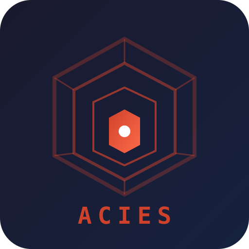
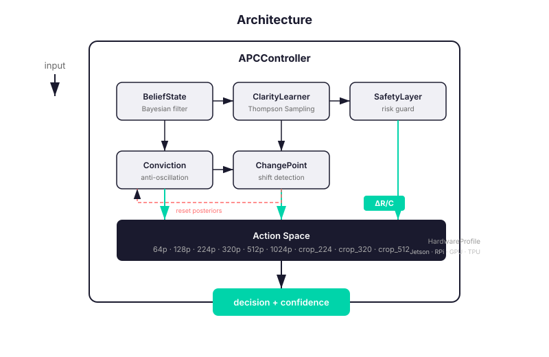

<div align="center">



# ACIES

### Adaptive Perception Control

A decision-theoretic framework for adaptively controlling visual perception
to minimize computational cost while maintaining target decision risk.

<br>

[](LICENSE)
[](https://www.python.org/downloads/)
[](https://go.dev/)
[](#c-acceleration)
[](#testing)
[](#benchmarks)

<br>

*Perception is not a fixed pipeline. It is a resource to control.*

</div>

---

## Why ACIES?

Every perception system wastes resources processing information that doesn't change the decision. ACIES solves this by treating perception as a **cost-risk optimization problem**.

| | Without ACIES | With ACIES |
|--|:--:|:--:|
| **Resolution** | Fixed (max) | Adaptive (optimal) |
| **Cost** | 385.8 | **93.6** |
| **Accuracy** | 98.8% | 90.8% |
| **Savings** | — | **76%** |

> **Trade 8% accuracy for 76% cost reduction.** Or tune the threshold to find your own sweet spot.

---

## Quick Start

### Python (stdlib only, zero dependencies)

```python
from acies import APCController, APCConfig, HardwareProfile

apc = APCController(APCConfig(
    confidence_threshold=0.92,
    hardware=HardwareProfile.jetson_orin(),
))

def clarity_fn(action):
    clarities = {
        "64p": 0.55, "128p": 0.65, "224p": 0.75,
        "320p": 0.82, "512p": 0.88, "1024p": 0.93,
        "crop_224": 0.85, "crop_320": 0.90, "crop_512": 0.92,
    }
    return clarities.get(action.name, 0.5)

result = apc.run(true_class=1, clarity_fn=clarity_fn)
print(f"Decision: {result.decision} | Cost: {result.total_cost:.1f} | Steps: {result.n_steps}")
```

### Go CLI (32,800 runs/sec)

```bash
go build -o acies-cli .

./acies-cli run --hardware jetson --verbose
./acies-cli bench --iterations 5000 --hardware rpi
```

### Docker

```bash
docker build -t acies .
docker run acies bench --iterations 1000
```

---

## Installation

```bash
git clone https://github.com/NICE-DEV226/ACIES.git
cd ACIES
```

| Component | Command | Notes |
|-----------|---------|-------|
| Python | _(none)_ | stdlib only, zero deps |
| C++ accelerator | `cd cpp && make` | Optional, 3-5x speedup |
| Go CLI | `go build -o acies-cli .` | Single binary |
| Docker | `docker build -t acies .` | Multi-stage, all-in-one |

**Verify:**
```bash
python3 test_apc.py          # 8/8 tests
./acies-cli version          # ACIES v0.1.0
```

---

## Architecture

<div align="center">



</div>

**Control loop:** Sample → Score (ΔR/C) → Adjust → Filter → Execute → Observe → Update → Repeat

---

## How It Works

| Step | Component | What it does |
|:----:|-----------|-------------|
| 1 | **Belief Tracking** | Maintains P(Y=1 \| observations) via Bayesian filtering |
| 2 | **Clarity Estimation** | Thompson Sampling learns P(correct \| action) online |
| 3 | **Action Scoring** | Computes ΔR/C (risk reduction per cost) for each action |
| 4 | **Conviction** | Anti-oscillation boosts high-clarity actions near threshold |
| 5 | **Safety Filtering** | Rejects actions that could exceed risk threshold |
| 6 | **Change-Point Detection** | Resets posteriors on distribution shifts |
| 7 | **Decision** | Stops when confidence ≥ threshold or max steps reached |

---

## Benchmarks

### MNIST (10,000 real images)

```bash
python3 examples/real_benchmark.py
```

| Method | Accuracy | Cost | Savings |
|--------|:--------:|:----:|:-------:|
| Fixed 1024p | 98.8% | 385.8 | — |
| **ACIES** | **90.8%** | **93.6** | **76%** |
| Fixed 224p | 82.1% | 76.5 | 80% |
| Random | 95.5% | 149.6 | 61% |

### Go CLI Performance

```bash
./acies-cli bench --iterations 5000
```

**32,800 runs/sec** — 70× faster than Python (476 images/sec)

### Hardware Profiles

| Profile | APC Cost | Fixed 1024p | Savings |
|---------|:--------:|:-----------:|:-------:|
| Default | 260.9 | 448.4 | 42% |
| Jetson Orin | 204.4 | 347.1 | 41% |
| Raspberry Pi 5 | 287.5 | 525.2 | 45% |
| Desktop GPU | 290.6 | 479.0 | 39% |
| Edge TPU | 53.4 | 92.0 | 42% |

---

## Testing

```bash
python3 test_apc.py
```

| # | Test | Description | Result |
|:-:|------|-------------|:------:|
| 1 | Base functionality | Accuracy, cost, exploration | ✓ |
| 2 | Hard tasks | High difficulty scenarios | ✓ |
| 3 | Distribution shift | Thompson adaptation | ✓ |
| 4 | Sensor failure | Degraded reliability | ✓ |
| 5 | Hardware profiles | All 5 profiles | ✓ |
| 6 | Stress test | 5,000 iterations | ✓ |
| 7 | Belief math | Bayesian verification | ✓ |
| 8 | Thompson convergence | Posterior accuracy | ✓ |

---

## Project Structure

```
ACIES/
├── acies/                  # Python package (8 modules)
│   ├── controller.py       # Main APC loop
│   ├── belief.py           # Bayesian belief tracker
│   ├── clarity_learner.py  # Thompson Sampling
│   ├── safety.py           # Risk guarantees
│   ├── conviction.py       # Anti-oscillation
│   ├── change_point.py     # BOCPD shift detection
│   ├── actions.py          # Action space & HW profiles
│   └── accelerator.py      # C++ ctypes wrapper
│
├── cpp/                    # C++ core library
│   ├── belief.h/.cpp       # Belief state
│   ├── clarity_learner.*   # Thompson Sampling
│   ├── acies.h/.cpp        # C API
│   └── Makefile
│
├── core.go                 # Go implementation
├── main.go                 # Go CLI (run/bench/config)
│
├── test_apc.py             # 8 robustness tests
├── examples/               # Benchmarks & demos
├── docs/                   # 9 documentation files
├── assets/                 # Logo & visual identity
├── Dockerfile              # Multi-stage build
└── README.md
```

---

## Documentation

| Doc | Description |
|-----|-------------|
| [Installation](docs/installation.md) | Setup guide for Python, Go, C++, Docker |
| [Architecture](docs/architecture.md) | Deep dive into control loop and algorithms |
| [Configuration](docs/configuration.md) | All configuration parameters |
| [CLI Reference](docs/cli-reference.md) | Go CLI commands and flags |
| [Python API](docs/python-api.md) | Complete Python API reference |
| [C++ API](docs/cpp-api.md) | C API for FFI (Python/Go/Rust) |
| [Examples](docs/examples.md) | 10 usage examples |
| [Benchmarks](docs/benchmarks.md) | Performance results on MNIST |
| [Contributing](docs/contributing.md) | Development guide |

---

## Tech Stack

| Layer | Tech | Performance |
|-------|------|-------------|
| CLI | Go | 32,800 runs/sec |
| Core | Python (stdlib) | 476 images/sec |
| Accelerator | C++ via ctypes | 3-5× Python speed |
| Tests | 8 robustness tests | all passing |
| Benchmark | 5 methods × 5 HW profiles | + MNIST 10k |
| Deploy | Multi-stage Dockerfile | Python + Go + C++ |

---

## Contributing

See [docs/contributing.md](docs/contributing.md).

## License

MIT License — see [LICENSE](LICENSE).

## Citation

```bibtex
@software{acies2026,
  title = {ACIES: Adaptive Perception Control},
  year = {2026},
  url = {https://github.com/NICE-DEV226/ACIES}
}
```

---

<div align="center">

**[Documentation](docs/architecture.md)** · **[API Reference](docs/python-api.md)** · **[Examples](examples/)** · **[Contributing](docs/contributing.md)**

</div>
